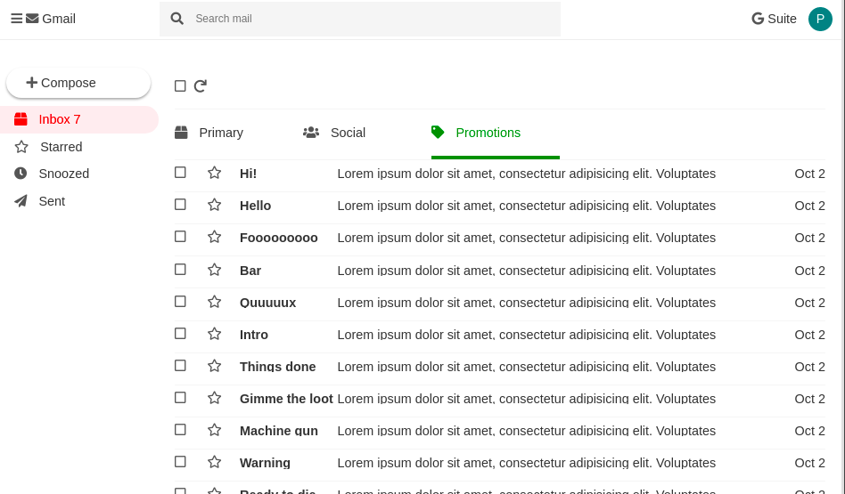

# Web email client build challenge!

Create the website pictured in the mockup. Make it look as close as you can to the mockup.

Rules:

1. Don't add any images, only use Font Awesome
2. You can use Google Fonts, if you want
3. One HTML file, one CSS file
4. No inline CSS
5. Just create the desktop layout

